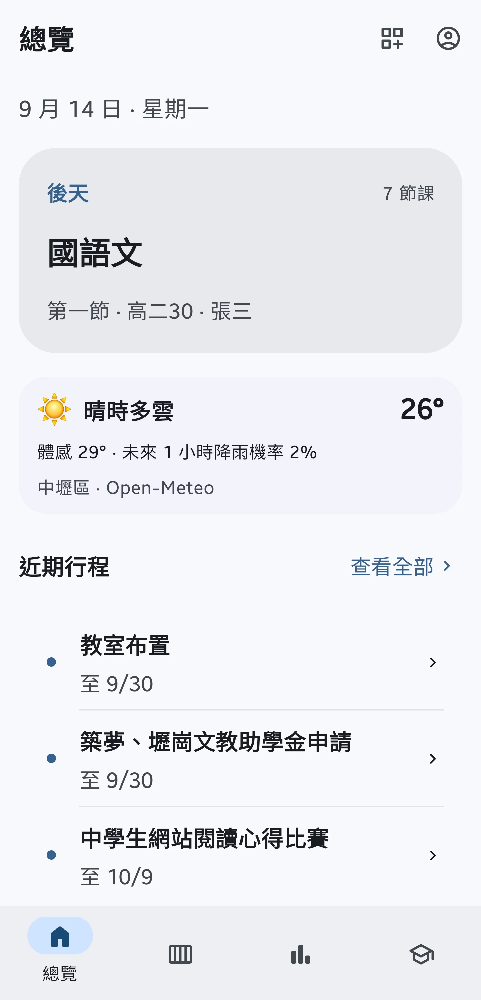
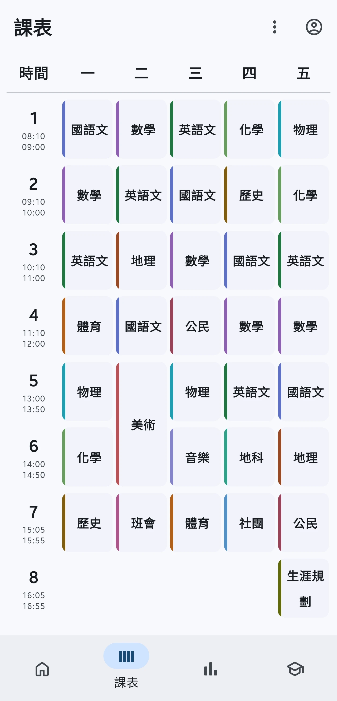
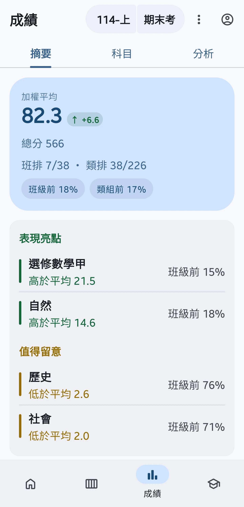
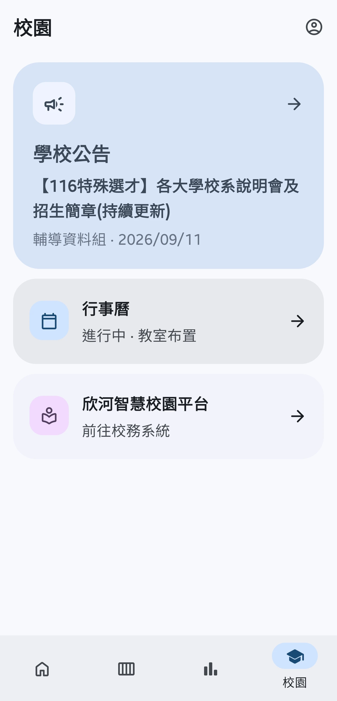

<p align="center">
  
</p>

<h1 align="center">CLHS Pocket</h1>

<p align="center">
  A campus companion for CLHS students
</p>

<p align="center">
  <a href="https://github.com/alvin000009238/clhs_pocket/releases/latest"></a>
  
  
  <a href="LICENSE"></a>
  <a href="https://deepwiki.com/alvin000009238/clhs_pocket"></a>
</p>

> [!IMPORTANT]
> CLHS Pocket is an unofficial third-party service independently developed by a student. It is not affiliated with CLHS or the Shin-Her Smart Campus platform.

CLHS Pocket is an Android app built with Kotlin, Jetpack Compose, and Material 3 Expressive. It gives CLHS students one place to view grades, schedules, public campus information, and more.

## Features

- 🧭 **Overview**: See the current or next class, weather, upcoming events, and important announcements in one place.
- 📊 **Grades**: View weighted averages, rankings, subject statistics, historical trends, and use the score simulator to work toward a target.
- 🗓️ **Schedule**: Check semester and weekly schedules, review schedule changes, customize subject information, and save timetable images.
- 🏫 **Campus information**: Access school announcements, the public calendar, and the school system from one place.
- 📱 **Widget and reminders**: View your schedule on the home screen and opt in to announcement updates and exam information change reminders.
- 🔒 **Local-first**: Offline cache, encrypted sessions, biometric lock, dark mode, and dynamic colors.

## Screenshots

<table>
  <tr>
    <td align="center"></td>
    <td align="center"></td>
    <td align="center"></td>
    <td align="center"></td>
  </tr>
</table>

## Privacy and security

- School sign-in is completed on the school's existing sign-in page; grades and schedules are handled directly between the user's device and the school system.
- Reusable login sessions are encrypted on the device.
- Grades, schedules, and student data may remain in the app's private cache; logout and data clearing follow the current data-clearing rules.

See the [security policy](SECURITY.md), [school system integration](docs/architecture/school-system.md), and [data flow](docs/architecture/data-flow.md) documentation.

## Download

[Download the latest APK](https://github.com/alvin000009238/clhs_pocket/releases/latest)

Supports Android 10 and later. Before signing in, you can use Overview, weather, upcoming events, school announcements, and the public calendar; Schedule, Grades, and the school system guide you to sign in when needed.

## Development

### Requirements

- Android Studio with Android SDK Platform 37 and Build Tools 37.0.0
- JDK 25
- Git; Windows developers can use PowerShell and `gradlew.bat`

### Quick start

```shell
git clone https://github.com/alvin000009238/clhs_pocket.git
cd clhs_pocket/android

# Build a fake-data Debug APK without connecting to the school system
.\gradlew.bat assembleDebug -PuseFakeData=true

# Install directly when an Android device or emulator is connected
.\gradlew.bat installDebug -PuseFakeData=true
```

Fake-data mode does not require a school account, additional environment variables, a Firebase service account, or a release keystore. Run JVM tests with:

```shell
.\gradlew.bat test
```

For full setup details, see [development setup](docs/development/setup.md), [fake-data mode](docs/development/fake-data.md), [building and running](docs/development/building.md), and [testing](docs/development/testing.md).

## Project structure

| Path | Purpose |
| --- | --- |
| [`android/`](android/) | Kotlin / Jetpack Compose Android app and the `:benchmark` module |
| [`docs/`](docs/) | Architecture, development, and contributor documentation |
| [`.github/workflows/`](.github/workflows/) | CI, CodeQL, and signed release workflows |

## Contributing

Please read the [contributing guide](CONTRIBUTING.md), [Code of Conduct](CODE_OF_CONDUCT.md), and [security policy](SECURITY.md) first. Issues, logs, pull requests, and screenshots must not include student IDs, names, cookies, tokens, passwords, or real grade data.

## License

[MIT](LICENSE) © 2026 alvin000009238
