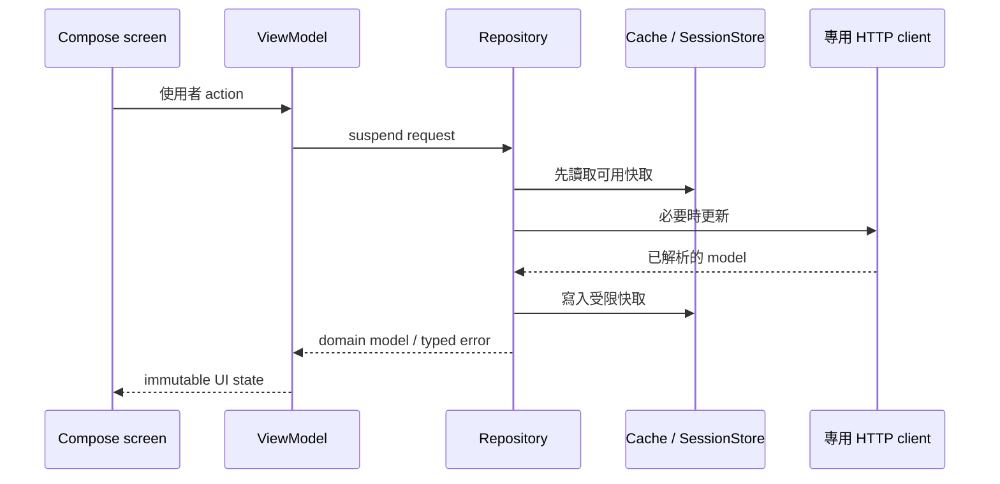

# 資料流與狀態擁有權

## 規則

- UI 只 render state 與呼叫 action；不得自行讀 session、cookie 或 cache。
- `ScoreViewModel.authState` 是登入狀態唯一來源；啟動還原期間不阻塞公開內容，Guest 可繼續使用公開 route，受保護 route 由 `AuthGate` 處理。
- `ScoreViewModel` 管理登入後成績與 session lifecycle；課表 route 由 `ScheduleViewModel` 擁有自己的 UI state。兩者都必須取消過期工作。
- repository 解析網路資料並處理 cache；`SchoolGradeClient` 集中校務系統 HTTP、cookie 及併發限制。
- `OverviewCoordinator` 聚合各來源並處理快取優先、部分失敗與公開天氣 fallback；Overview UI 不直接依賴 repository。
- 公開公告、行事曆、公告更新提醒與天氣各自使用無 cookie client，不能回退到登入 session；公告更新提醒的基準／未讀狀態與天氣授權碼各自留在對應的本機儲存邊界。
- Widget 只讀專用課表快照；它不能自行登入或向校務 API 查詢。
- session cache 是加密資料，不等於一般 UI cache；清除登入或隱私資料時失敗必須向上傳遞。

錯誤先依來源保留可辨識的類別，再由 ViewModel 映射成固定且不含敏感資訊的使用者文案。不要把 HTTP body、URL、cookie 或例外原文直接顯示。
