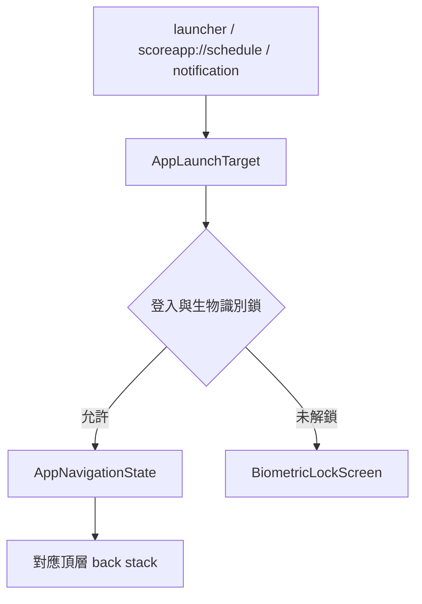

# 導航與外部入口

App shell 不論 Guest 或已登入都使用同一套 Navigation 3。`TopLevelDestination` 宣告「總覽、課表、成績、校園」的順序；`AppNavigationState` 持有四個 `rememberNavBackStack()`，因此切換頂層目的地不會清掉其巢狀返回紀錄。

## Route 與登入狀態

- `AppRoute.authRequirement()` 將 route 分為公開與需要校務 Session 兩類。總覽、校園、公告、行事曆、個人與設定相關頁面維持 Guest 可用；課表、成績、成績模擬器、科目趨勢與校務系統入口需要登入。
- 受保護 route 由 `AuthGate` 顯示行內登入入口；登入完成後只移除登入 route，保留使用者原本想開啟的目的地。
- Welcome、外觀、權限、帳號是同一個 `NavDisplay` 的首次設定 route；首次設定期間不顯示 App-level Navigation Bar／Rail。
- 首次設定以 `app_settings` 的 `has_completed_onboarding_v2` 判定。缺少旗標時原子清空 App 設定並寫入 `false`，所以舊版升級會重跑 Welcome；完成或選「稍後登入」後寫入 `true`，後續啟動不再重設。這與 session authority 分開：舊 session 不遷移，私人功能需要重新登入，新格式 VALID session 則保留正常 restore。
- 「個人」同時是 Profile 與設定 Hub，不再建立獨立的 Settings／About route；使用統計、開源授權、開發者選項與背景工作狀態仍是 secondary route。

- `SchoolCalendarRoute(eventId)` 可攜帶公開事件 ID；近期行程與倒數卡片使用此入口，定位並標示對應事件。清單載入後只自動定位一次，計入搜尋列、重複活動提示與日期標題，返回或重組不重設捲動。指定的已結束事件仍保留，來源缺少事件時提示使用者。

## 維護規則

- 新頂層目的地先擴充 `TopLevelDestination` 與 `AppRoute`，不要把 state 藏在 Navigation Bar／Rail Composable。
- 外部入口先轉為 `AppLaunchTarget`；Widget、deep link 與通知不得在 UI 內另建 navigation state。
- 不要在根層、登入頁或成績頁各自用 `BackHandler` 重複攔截 Predictive Back；交由 `NavDisplay`。
- 成績頁的「總覽、科目、分析」是 feature 內 secondary navigation，不是頂層目的地。
