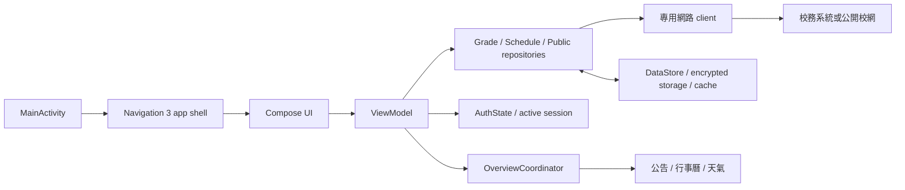

# 架構總覽

壢中 Pocket 是一個單一 Android app module。`MainActivity` 組裝設定、登入狀態、外部入口與安全鎖，再交給 `ScoreApp`／App shell。App shell 採 Guest-first：公開內容可在未登入時使用，需要校務 Session 的畫面才由 `AuthGate` 顯示登入入口。整體仍以可追蹤資料流與安全邊界為優先：UI 透過 ViewModel 協調資料，repository 透過專用 client 存取外部資料，session 與 cache 留在資料層。

## 讀程式的推薦順序

1. [`MainActivity.kt`](../../android/app/src/main/java/com/clhs/score/MainActivity.kt)：組裝根層 state、深連結與安全鎖。
2. [`ui/navigation/AppNavigation.kt`](../../android/app/src/main/java/com/clhs/score/ui/navigation/AppNavigation.kt)：頂層目的地與各自 back stack。
3. 對應的 screen 與 ViewModel，例如 `ui/GradesScreen.kt`、`viewmodel/ScoreViewModel.kt`。
4. [`data/`](../../android/app/src/main/java/com/clhs/score/data/) 的 repository、client、cache 和 model。
5. 同名 unit test 或 [`ArchitectureBoundaryTest.kt`](../../android/app/src/test/java/com/clhs/score/ArchitectureBoundaryTest.kt)。

## 核心決策

- 保留單一 app module，先降低 package 內的混雜與檔案尺寸，而非引入跨 module 建置成本。
- 頂層導覽由 Navigation 3 擁有；每個頂層目的地保留自己的 stack。
- `AuthState` 是登入狀態唯一來源；公開 route 與需要 Session 的 route 由 route contract／`AuthGate` 區分，不以登入狀態切換兩套 App shell。
- `OverviewCoordinator` 聚合課表、公告、行事曆、提醒變更與天氣，畫面只 render 聚合後的 `OverviewState`。
- 校務系統、公開校網、Widget 與 WebView 使用不同的資料與 session 邊界。
- 假資料是可重複的本機 UI 開發入口，不是另一套產品架構。

延伸閱讀：[模組與責任](modules.md)、[資料流](data-flow.md)、[導航](navigation.md)、[校務系統整合](school-system.md)。
